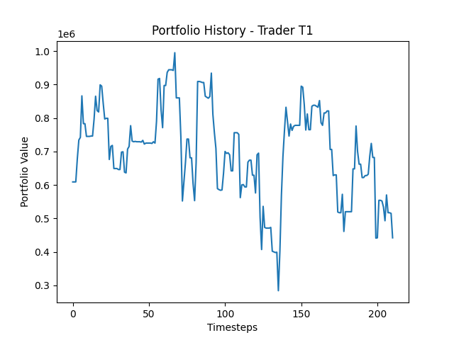
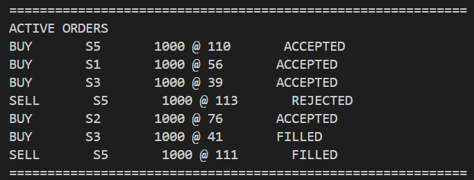
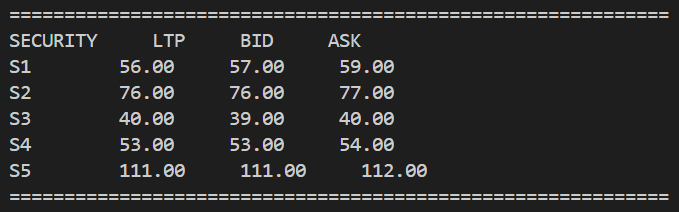

# Electronic Stock Exchange Simulation

A Python-based electronic stock exchange simulator implementing:

- Limit Order Book (LOB)
- Price-Time Priority Matching
- Order Management System (OMS)
- Portfolio & PnL Tracking
- Order Expiry (TTL)
- Partial Order Fills
- Market Depth Tracking
- Simulated Traders
- Exchange Matching Engine

---

# Project Architecture

## Components

### StockExchange
Handles:
- Market state
- Order routing
- Matching engine
- Trade execution
- Order expiry
- Market dashboards

### OMS (Order Management System)
Handles:
- Trader balances
- Portfolio accounting
- Reserved balances
- Order validation
- PnL calculation
- Portfolio dashboard

### Security
Represents a listed security and maintains:
- Last traded price (LTP)
- Bid order book
- Ask order book
- Best bid/ask

### Trader
Represents a market participant:
- Places buy/sell orders
- Transfers funds between bank and trading account
- Maintains OMS instance

---

# Features

## Order Matching
- Price-Time Priority
- Partial Fills
- Order Expiry
- Order Rejection
- Trade Execution

## Portfolio Accounting
- Average Buy Price
- Unrealised PnL
- Realised PnL
- Total Equity Tracking

## Market Simulation
- Multiple traders
- Multiple securities
- Randomized order generation
- Passive/Aggressive order behaviour
- Dynamic market prices

---

# Simulation Flow

1. Traders generate buy/sell orders
2. Orders are validated through OMS
3. Orders are sent to Exchange
4. Matching engine executes trades
5. OMS updates:
   - balances
   - reservations
   - portfolios
   - PnL
6. Market dashboards are updated

---

# Example Market Dashboard

```text
============================================================
SECURITY     LTP     BID     ASK
S1        72.92     72.50     73.00
S2        77.92     77.85     78.10
============================================================
```

---

# Example Portfolio Dashboard

```text
============================================================
T1 Available Cash: 272093.08

PORTFOLIO:
SECURITY   Quantity   Avg Buy Price   LTP   Unrealised Return
S1         17000      74.20           72.92   -1.68%
S2          2000      76.95           77.92    1.26%

TOTAL EQUITY: 1543210.22
============================================================
```

---

# Portfolio Performance

## Trader Portfolio History

Add your generated graphs here:

```md

```

You can include:
- portfolio growth curves
- realised/unrealised pnl plots
- market price evolution

---

# Active Orders View

Add screenshots here:

```md

```

---

# Security Dashboard

Add screenshots here:

```md

```

---

# How to Run

```bash
python simulation.py
```

---

# Author

Arush Jain